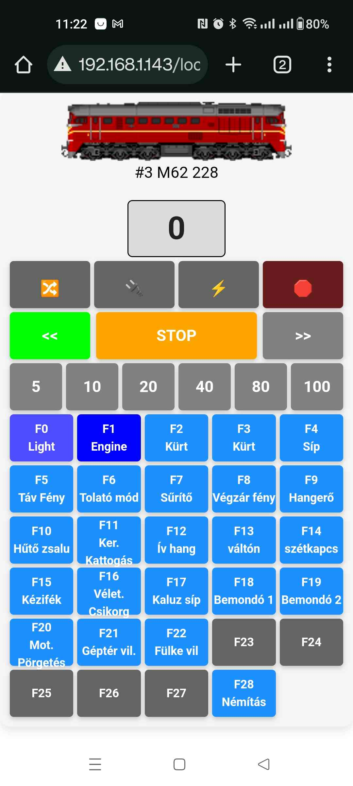
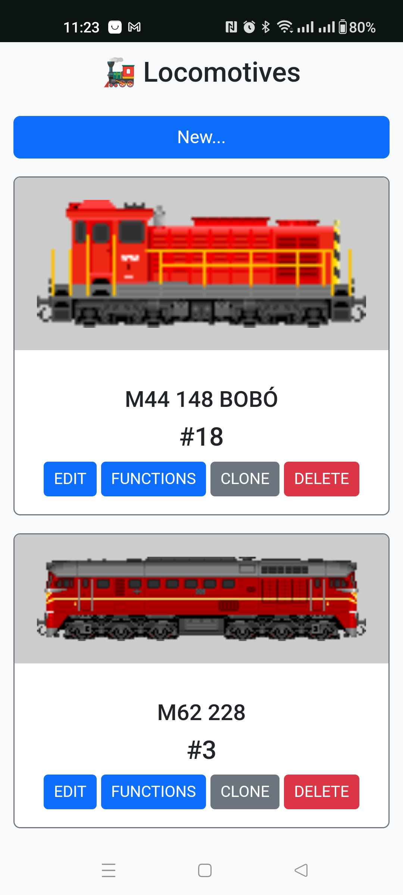
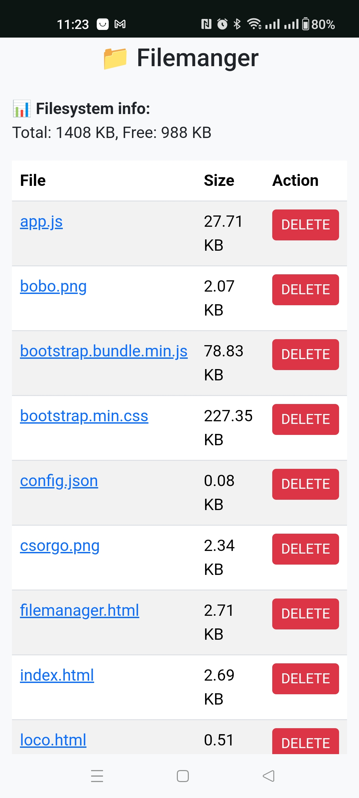

# DCCExpress-Mini

### ⚠️ Under development ⚠️  
This project is a customized fork of the [DCC-EX CommandStation-EX](https://github.com/DCC-EX/CommandStation-EX) project, built specifically for ESP32-based systems. 
The goal is to provide a standalone wireless DCC control system with a mobile-friendly user interface, file management, and real-time communication.

Related project: [DCCExpress](https://github.com/jungervin/DCCExpress)


## 🚀 Features

- 🚂 **EX-CSB1 ESP32 based command station**
- 🌐 **Built-in web server** with Bootstrap UI optimized for mobile devices
- 📡 **WebSocket support** for real-time control and feedback
- ✏️ **Fully editable loco list** (image, name, address, speed, functions)
- 🛠️ **Function editor** with momentary toggles and customizable labels
- 🗃️ **LittleFS storage** for persistent config, loco data, and file uploads
- 🗂️ **File manager** interface for maintaining and organizing files


## ✅ What you need to do

1. **Configure your hardware and network settings**  
   Open the `config.h` file and adjust it according to your setup (e.g. connected devices, Wi-Fi credentials).  
   Don’t forget to add the following directive to enable the web server:

   ```cpp
   #define HTTP
   ```

2. **Compile and upload the firmware**  
   Use PlatformIO or the command line to build and flash the firmware to your ESP32 device.

3. **Upload the web interface (data folder)**  
   Upload the contents of the `data/` folder using:

   ```bash
   > pio run -e ESP32 --target uploadfs
   ```

   Or use the **"Upload Filesystem Image"** option from the PlatformIO menu.  
    ```
    ⚠️ Make sure to run these commands from the directory where your
    `platformio.ini` file is located.
    ```


## Web Interface & Client-Side Development

### ⚠️ NodeJS  must be installed ⚠️

* Install  
```bash 
> cd DCCExpress
DCCExpress> npm install
```

* Dev  
```bash
DCCExpress> npm run dev
```

* Build to Data  
```bash
DCCExpress> npm run build
DCCExpress> cd ..
> pio run -e ESP32 --target uploadfs
```

* Or Build + Upload to EXCSB1
```bash
DCCExpress> npm run upload
```

## 🛠️ Changes in This Fork

1. **WebServer and WebSocket implementation**  
   - Added an embedded HTTP server with LittleFS/SD card file hosting  
   - Added WebSocket support via `AsyncWebSocket` for real-time communication with clients  
   - UI pages (e.g., loco control, file manager) are now loaded from the device

2. **Serial output redirection (USB_SERIAL)**  
   - Replaced `USB_SERIAL` with a `HTTPSerialWrapper` class  
   - This wrapper forwards all serial output to both the original stream and all connected WebSocket clients.
   - Useful for debugging or monitoring system messages over the network

## 🖼️ Images







