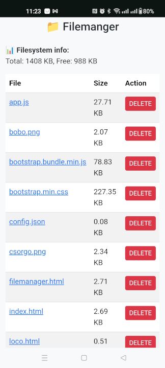

# DCCExpress-Mini

### ⚠️ Under development ⚠️  
This project is a customized fork of the [DCC-EX CommandStation-EX](https://github.com/DCC-EX/CommandStation-EX) project, built specifically for ESP32-based systems. 
The goal is to provide a standalone wireless DCC control system with a mobile-friendly user interface, file management, and real-time communication.

Other project: [DCCExpress](https://github.com/jungervin/DCCExpress)

---

## 🚀 Features

- 🚂 **EX-CSB1 ESP32 based command station**
- 🌐 **Built-in web server** with Bootstrap UI optimized for mobile devices
- 📡 **WebSocket support** for real-time control and feedback
- ✏️ **Fully editable loco list** (image, name, address, speed, functions)
- 🛠️ **Function editor** with momentary toggles and customizable labels
- 🗃️ **LittleFS storage** for persistent config, loco data, and file uploads
- 🗂️ **File manager** interface for maintaining and organizing files

## Building
### ⚠️ NodeJS  must be installed ⚠️

* Install  
```bash 
> cd DCCExpress
DCCExpress> npm install
```

* Dev  
```bash
DCCExpress> npm run dev
```

* Build to Data  
```bash
DCCExpress> npm run build
DCCExpress> cd ../DCCEx
DCCEx> pio run -e ESP32 --target uploadfs
```

* When compiling DCC-EX, the web server must be enabled in config.h using the HTTP preprocessor directive:  
```cpp
#define HTTP
```

## 🖼️ Images





